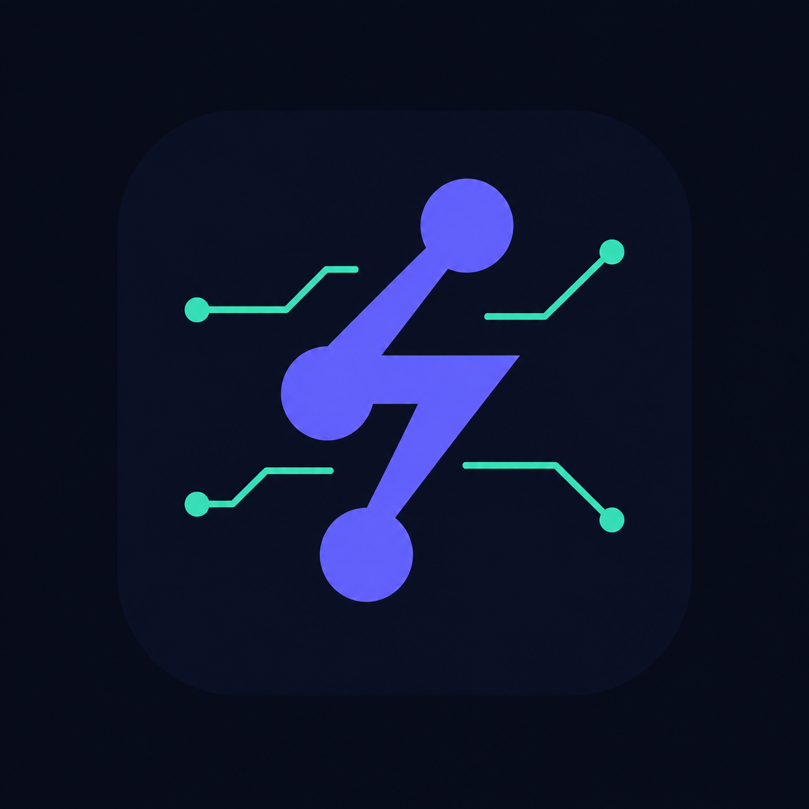

# Indy-Dots ⚡
### Self-Hosted AI Teammates — the open, cost-disciplined counterpart to OpenAI's Dot & xAI's Grok Bot

<p align="center">
  
</p>

> Run a private AI operator on a $5/mo Hetzner VPS: tiered model routing, zero-token
> mechanical triage, ledger-backed safety gates, and a compounding Markdown vault.
> No SaaS connectors. No fabricated dashboards. MIT licensed.

---

## 🙏 Credits: the products that defined this category

Indy-Dots exists because two closed products proved that AI teammates — not chatbots —
are how this technology should work:

- **[Grok Bot](https://x.ai/bot) (xAI)** — the blueprint for bot teams. Bots that sign
  in to your tools once and use them like you do, work in parallel 24/7, learn routines
  by watching you do a task once, and — the part we admire most — **pause for operator
  approval before anything goes out** ("36 drafts queued · 0 sent"). That approval-pause
  is exactly what our yellow gate implements (`server/app/gates/approval_manager.py`).
  Its fleet even ships a **Chief of Staff** coordinating the specialists; our `atlas`
  profile is a direct homage to that design.
- **OpenAI's Dot** — for mainstreaming the "dots" vision: many small, specialized
  agents orbiting one orchestrator, doing real work in your tools instead of chatting
  about it.

*(and to [Open-Dots](https://github.com/Anil-matcha/Open-Dots) for showing an open
implementation of the idea was possible.)*

Both Grok Bot and Dot are brilliant. Both are also closed SaaS: seat pricing, their
cloud, their guardrails, their definition of "safe". **Indy-Dots takes the same vision
and inverts the trade: you own the loop.**
*Not affiliated with OpenAI or xAI.*

### What self-hosting changes

| Concern | Grok Bot / Dot (SaaS) | Indy-Dots (self-hosted) |
| :--- | :--- | :--- |
| **Hosting** | Their cloud | Your $4–6/mo Hetzner VPS — nothing leaves your box except model calls you choose |
| **Price** | Seat SaaS ($20/mo Grok via Cursor up to $100–$500/mo Dot Pro tiers) | VPS + your own model keys; free/cheap worker tiers for specialists |
| **Cost discipline** | Opaque usage limits | Zero-token mechanical routing + tiered fleet; every dispatch is visible |
| **Approval gates** | Bots pause for your OK, rules defined in their UI (a great idea!) | Same pattern, but enforced in code: append-only JSONL ledger, dry-run receipts, red lines you define in `server/app/policy.py` |
| **Verification** | Model output with platform guardrails | Evidence-based gate: outputs must cite links/paths/data or they fail; fail-closed; 1 corrective pass |
| **Secrets** | Platform-managed | Auto-rejected at the gate with a ledger trail — even read-style requests |
| **Memory** | On their servers | Your Markdown vault + SQLite index — exportable, Obsidian-friendly, compounds across restarts |
| **License** | Closed | MIT — inspect it, fork it, run it anywhere |

If you want the polished SaaS experience and accept the trade, pay them — they're good.
If you're technical and want the same teammate pattern running under **your** keys on a
**$5** VPS with **auditable** governance you can `grep`, keep reading.

### Why technical operators pick this

- **Own the full loop:** SSH into the box, read the JSONL ledger, `git diff` the policy.
  No admin console, no ticket to support to answer "why did it send that?"
- **BYO models, BYO keys:** any OpenAI-compatible endpoint (OpenRouter, Nebius, Groq,
  DeepSeek, Ollama). Swap primary/worker tiers in `.env`, no per-seat renegotiation.
- **Governance as code:** red/yellow lines live in one file (`server/app/policy.py`),
  covered by tests, consumed by both the gateway and the CLI runner. Fork the rules,
  don't click through them.
- **Files over black boxes:** Markdown vault + SQLite you can back up, `rsync`,
  or open in Obsidian. Logs you can tail. Metrics computed from the real ledger.
- **Hacker economics:** $5 VPS + cheap worker models for specialists, primary model
  only when reasoning is needed. Classification costs zero tokens by design.

---

## What Indy-Dots actually does (and doesn't) do today

**Working:**
- **Two-tier model routing** — a zero-token mechanical classifier routes every task
  (`/search`, `/research`, `/write`, `/seo`, `/ops`, `/code`, or natural language) to a free/cheap
  worker model or the primary reasoning model. Classification never costs tokens.
- **Governed web search (`/search`, `POST /api/search`)** — read-only You.com search
  behind the gate: `search_web` stays in `SAFE_ACTIONS`, every run writes an
  `AUTO_APPROVED` ledger entry, emits `search_dispatch`/`search_results` audit
  events, and feeds results to the model as context. `YDC_API_KEY` optional —
  empty means keyless free profile. Fails closed, never fabricates.
- **Governed action gates** — mutating requests (publish, email, ticket writes, deletes,
  deploys) pause as `PENDING_APPROVAL` with a dry-run receipt in an append-only JSONL
  ledger. Red-line content (`.env`, `id_rsa`, `rm -rf`, `DROP TABLE`, force-push,
  pipe-to-shell) is auto-rejected — even for "read" requests.
- **Governed connectors (GitHub + MCP)** — `list_issues` / `mcp_read` auto-approve
  as SAFE reads with a ledger trail and execute zero-token; `create_issue` /
  `mcp_write` pause as `PENDING_APPROVAL` with a dry-run receipt and never execute
  until an operator resolves the gate. Red lines enforced via `policy.py`, fail-closed
  on missing `GITHUB_TOKEN` / network errors (`MCP_ALLOWLIST` gates MCP servers).
- **Opt-in computer runtime (`computer navigate|click|type|snapshot|browse`,
  `POST /api/computer/act`, `GET /api/computer/status`)** — prompts matching the
  narrow `computer <verb>` pattern submit `computer_navigate`, which is never SAFE:
  every run pauses as `PENDING_APPROVAL` with a dry-run receipt (or hard-stops on
  red lines in the params) and never executes until approved. Default
  `COMPUTER_PROVIDER=fake` is an inert deterministic stub; `docker` (Playwright
  image, per-assistant workspace under `WORKSPACE_ROOT/computers/`, read-only
  rootfs, dropped caps, resource limits, fail-closed without daemon/image) and a
  `remote` stub are opt-in. Not a hardened sandbox — see SECURITY.md.
- **Fail-closed verification gate** — outputs must contain concrete evidence (links,
  paths, code, data). On failure: exactly one corrective pass, then halt and report.
  If the verifier itself is unreachable, the output is marked unverified — never passed.
- **Compounding vault** — verified research outputs persist as Obsidian-style Markdown
  + a SQLite index, and are recalled into future task context.
- **Encrypted provider keys (`POST /api/settings/keys`)** — primary/worker/fallback,
  You.com, and GitHub keys resolve env > encrypted store > "". Saved keys are
  Fernet-encrypted at rest (`chmod 600`); the API only ever reports names +
  `configured` bools. Blank saves preserve the stored secret.
- **Routine scheduler (`/api/routines`, `ROUTINES_ENABLED=1`, default off)** —
  `every_<N>m/h` and `daily_HH:MM` UTC schedules tick every 60s in-process and
  run through `execute_task`, so mutating routines still pause for approval and
  errors are recorded, never fabricated.
- **Real dashboard** — chat, approvals queue, live fleet from `profiles/*.yaml`, vault
  browser, and metrics computed from the actual ledger (no placeholder numbers).
- **One-command Hetzner bootstrap** — swap, UFW, Docker, secrets generation, HTTPS via Caddy.

**Not yet (tracked as roadmap):**
- Full tool execution behind the gate (Linear/Gmail dispatchers, MCP stdio spawn) —
  GitHub (`list_issues`/`create_issue`) and a generic MCP JSON-RPC stub with
  `MCP_ALLOWLIST` now run governed; remaining executors are the next milestone.
- Telegram companion, embeddings-based vault recall, multi-user auth.

---

## Architecture

<p align="center">
  
</p>

---

## Quick Start

### 1. One-command Hetzner deployment

Provision a fresh Ubuntu 22.04/24.04 VPS (CX22/CPX11/CAX11) pointed at your domain, then:

```bash
git clone https://github.com/your-org/indy-dots.git /opt/indy-dots
cd /opt/indy-dots
sudo ./scripts/setup-hetzner.sh your-domain.com
```

The bootstrap script installs Docker + Compose, configures 2GB swap and UFW,
generates a 64-hex `AUTH_TOKEN` into `.env` (`chmod 600`, never printed to stdout),
and syncs workspace protocols and role profiles to `/opt/data`.

### 2. Configure models

```bash
nano /opt/indy-dots/.env
```

```bash
# Primary reasoning model (Chief of Staff, coder, verification)
PRIMARY_MODEL=anthropic/claude-3.7-sonnet
PRIMARY_MODEL_API_KEY=sk-or-v1-...

# Worker fleet (researcher, writer, seo, ops) — free/cheap tier
WORKER_MODEL=deepseek/deepseek-chat
WORKER_MODEL_API_KEY=sk-or-v1-...
```

Any OpenAI-compatible endpoint works (OpenRouter, Nebius, Groq, DeepSeek, Ollama).
With **no API key configured, the gateway still runs** — routing and gates work,
the model step reports honestly that it is not configured.

### 3. Launch

```bash
docker compose -f docker-compose.prod.yml up -d --build
```

Open `https://your-domain.com`, click **Set token**, paste your `AUTH_TOKEN`.

> The web build can also bake the token at build time via `VITE_AUTH_TOKEN`
> (see `docker-compose.prod.yml`). The server enforces the same token on every
> route either way.

### Local development

```bash
# Backend
cd server
python3.12 -m venv .venv && source .venv/bin/activate
pip install -r requirements-dev.txt
uvicorn app.main:app --reload --port 8642   # AUTH_TOKEN=test-token-abcdef123456 for dev

# Frontend
cd web && npm install && npm run dev        # proxies /api via nginx in Docker;
                                            # for `npm run dev`, set VITE_GATEWAY_URL=http://localhost:8642

# Tests
cd server && pytest tests/ -q
```

---

## Repository Layout

```
server/
  app/
    main.py                 # FastAPI gateway (auth on every /api route)
    auth.py                 # Bearer auth + production boot guard
    config.py               # Env settings
    policy.py               # ★ Single source of truth: red lines + mutation intents
    profiles.py             # Loads profiles/*.yaml into the fleet
    mechanical_triage.py    # ★ Zero-token intent classifier (canonical)
    orchestrator/
      chief_of_staff.py     # Task pipeline: route → recall → search → gate → dispatch → verify → vault
      verification_gate.py  # Evidence check, fail-closed, 1-pass corrective
    tools/
      web_search.py         # Governed read-only You.com search (P2: /search, POST /api/search)
    computer/               # ★ Opt-in computer runtime (P4): fake/docker/remote + governed path
    gates/
      approval_manager.py   # Yellow-gate ledger + approval resolution
    memory/vault.py         # Markdown + SQLite compounding memory
    security/
      credential_store.py   # Fernet-encrypted provider keys (env > store > "")
    routines/
      scheduler.py          # In-process routine tick (ROUTINES_ENABLED=1, default off)
      store.py              # SQLite routine CRUD (DATA_DIR/routines.db)
  tests/                    # policy, triage, gates, API, boot guard, search, connectors, computer
profiles/                   # Role definitions (atlas, researcher, writer, seo, ops, coder)
workspace-template/         # AGENTS.md / SOUL.md / TOOLS.md protocols synced to the VPS
scripts/
  setup-hetzner.sh          # 1-command VPS bootstrap
  deploy.sh                 # GitOps sync; REBUILD=1 picks up code changes
  gate_runner.py            # Standalone CLI gate (same policy module as the server)
web/                        # React dashboard: chat, approvals, fleet, vault, metrics
web/public/brand/           # Logo, hero, architecture visuals
```

---

## Safety model

See [SECURITY.md](SECURITY.md) for the full model and the hardened-deployment
checklist. Short version:

- **Red lines** auto-reject: secrets access, destructive commands, privilege escalation,
  remote script execution — logged, never executed.
- **Yellow lines** pause for operator sign-off with a dry-run receipt in the ledger.
- Production refuses to boot without a strong `AUTH_TOKEN`.
- Gateway and web bind to loopback in prod; Caddy terminates public HTTPS.

## Contributing

PRs welcome. `pytest tests/ -q` and `npm run build` must pass (CI enforces both).
If you touch safety behavior, `server/app/policy.py` is the single place to change —
both the gateway and the CLI runner consume it, and its tests enumerate every rule.

## License

MIT — see [LICENSE](LICENSE).
